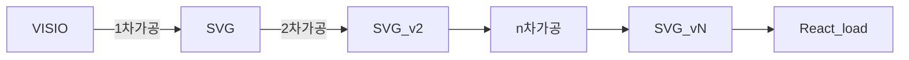

# SVG React 활용방안
목적 : React에서 SVG 를 Load 하여 특정 attribute , value , Style을 제어


## React 에서 SVG를 Load 하는 방법

### 1. \ 내 src를 추가 ( 부적합 )
```Javascript

```   
### 2. svg 내 namespace 형식 치환 후 render ( 보 )
Visio에서 Export한 SVG 파일 그대로 사용 불가 아래와 같이 치환 필요
단, svg row file 이나 마찬가지므로 react에서 제어 불가 ( javascript로 가능 )
|AS-IS	|TO-BE|
|-------|-------
|xmlns:xlink|	xmlnsXlink	|
|xmlns:ev	|xmlnsEv	|
|xmlns:v	|xmlnsV	|
|xml:space|	xmlSpace	|
|v:helloWorld|	vHelloWorld|   

### 3. Component 로 변환 후 render ( 적합 )
React에서 제어가능   
Online converter : [svg2jsx](https://www.svgviewer.dev/svg-to-react-jsx)

## SVG Convert to React Component

### 1차가공
- 스탠실을 이용한 Custom Props 추가
  - onclick="eventHandler(val)"
  - mnemonic="AAAAA"
  - nextlv="next mnemonic name"
  - script="AAAAA & BBBBB" => 표준 협의 필요      
- 결과
```xml
	<style type="text/css">
	<![CDATA[
		.st18 {fill:#3f3f3f;stroke:#bfbfbf;stroke-linecap:round;stroke-linejoin:round;stroke-width:1}
	]]>
	</style>
.... 중간 생략
<g id="shape431-243" v:mID="431" v:groupContext="shape" transform="translate(379.276,-871.654)">
	<title>시트.431</title>
	<v:custProps>
		<v:cp v:nameU="Row_1" v:lbl="onClick" v:type="0" v:langID="1033" v:val="VT4(LNA Controller(detail))"/>
		<v:cp v:nameU="Row_2" v:lbl="mnemonic" v:type="0" v:langID="1042" v:val="VT4(AAAAAA)"/>
		<v:cp v:nameU="Row_2" v:lbl="nextlv" v:type="0" v:langID="1042" v:val="VT4(next mnemonic name)"/>
	</v:custProps>
	<v:userDefs>
		<v:ud v:nameU="visVersion" v:val="VT0(15):26"/>
		<v:ud v:nameU="CPMSetList" v:prompt="[CPM11]mnemonic,onClick" v:val="VT4(visioTest)"/>
	</v:userDefs>
	<g id="shadow431-244" v:groupContext="shadow" v:shadowOffsetX="2.44929E-16" v:shadowOffsetY="-4" v:shadowType="3"
			transform="matrix(1,0,0,1,0,4)" class="st13"/>
	<rect x="0" y="1085.74" width="297.638" height="28.2784" class="st18"/>
	</g>
</g>
```   
### 2차가공
- css 우선순위 조정을 위한 style(Class) inline 적용
- CustomProps attribute로 변환 & inline 재배치   
결과
```xml
<g id="shape431-243" v:mID="431" v:groupContext="shape" transform="translate(379.276,-871.654)">
	<title>시트.431</title>
	<v:userDefs>
		<v:ud v:nameU="visVersion" v:val="VT0(15):26"/>
		<v:ud v:nameU="CPMSetList" v:prompt="[CPM11]mnemonic,onClick,nextlv" v:val="VT4(visioTest)"/>
	</v:userDefs>
	<g id="shadow431-244" v:groupContext="shadow" v:shadowOffsetX="2.44929E-16" v:shadowOffsetY="-4" v:shadowType="3"
			transform="matrix(1,0,0,1,0,4)" class="st13"/>
	<rect x="0" y="1085.74" width="297.638" height="28.2784" fill="#3f3f3f" stroke="#bfbfbf" stroke-linecap="round" stroke-linejoin="round" stroke-width="1" onclick="eventhandler()" mnemonic="AAAAA" nextlv="next mnemonic name" />
	</g>
</g>
```
