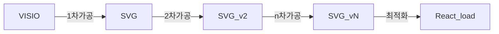

# SVG React 활용방안
목적 : React에서 SVG 를 Load 하여 특정 attribute , value , Style을 제어
   
## React 에서 SVG를 Load 하는 방법

### 1. \ 내 src를 추가 ( 부적합 )
```Javascript

```   
### 2. svg 내 namespace 형식 치환 후 render
Visio에서 Export한 SVG 파일 그대로 사용 불가 아래와 같이 치환 필요   
svg row file 은 react에서 제어 불가 ( javascript로는 가능 )
|AS-IS	|TO-BE|
|-------|-------
|xmlns:xlink|	xmlnsXlink	|
|xmlns:ev	|xmlnsEv	|
|xmlns:v	|xmlnsV	|
|xml:space|	xmlSpace	|
|v:helloWorld|	vHelloWorld|   

### 3. Component 로 변환 후 render ( 적합 )
React Level에서 제어가능   
Online converter : [svg2jsx](https://www.svgviewer.dev/svg-to-react-jsx)

## SVG Convert to React Component

### 1차가공
- 스탠실을 이용한 Custom Props 추가  => 표준 협의 필요     
  - onclick="eventHandler(val)"
  - mnemonic="AAAAA"
  - nextlv="next mnemonic || svg name"
  - input="true"
  - script="AAAAA & BBBBB"    
- 결과
```xml
	<style type="text/css">
	<![CDATA[
		.st18 {fill:#3f3f3f;stroke:#bfbfbf;stroke-linecap:round;stroke-linejoin:round;stroke-width:1}
	]]>
	</style>
.... 중간 생략
<g id="shape431-243" v:mID="431" v:groupContext="shape" transform="translate(379.276,-871.654)">
	<title>시트.431</title>
	<v:custProps>
		<v:cp v:nameU="Row_1" v:lbl="onClick" v:type="0" v:langID="1033" v:val="VT4(LNA Controller(detail))"/>
		<v:cp v:nameU="Row_2" v:lbl="mnemonic" v:type="0" v:langID="1042" v:val="VT4(AAAAAA)"/>
		<v:cp v:nameU="Row_2" v:lbl="nextlv" v:type="0" v:langID="1042" v:val="VT4(next mnemonic name)"/>
	</v:custProps>
	<v:userDefs>
		<v:ud v:nameU="visVersion" v:val="VT0(15):26"/>
		<v:ud v:nameU="CPMSetList" v:prompt="[CPM11]mnemonic,onClick" v:val="VT4(visioTest)"/>
	</v:userDefs>
	<g id="shadow431-244" v:groupContext="shadow" v:shadowOffsetX="2.44929E-16" v:shadowOffsetY="-4" v:shadowType="3"
			transform="matrix(1,0,0,1,0,4)" class="st13"/>
	<rect x="0" y="1085.74" width="297.638" height="28.2784" class="st18"/>
	</g>
</g>
```   
### 2차가공
- css 우선순위 조정을 위한 style(Class) inline 적용
- CustomProps attribute로 변환 & inline 재배치   
- 결과
```xml
<g id="shape431-243" v:mID="431" v:groupContext="shape" transform="translate(379.276,-871.654)">
	<title>시트.431</title>
	<v:userDefs>
		<v:ud v:nameU="visVersion" v:val="VT0(15):26"/>
		<v:ud v:nameU="CPMSetList" v:prompt="[CPM11]mnemonic,onClick,nextlv" v:val="VT4(visioTest)"/>
	</v:userDefs>
	<g id="shadow431-244" v:groupContext="shadow" v:shadowOffsetX="2.44929E-16" v:shadowOffsetY="-4" v:shadowType="3"
			transform="matrix(1,0,0,1,0,4)" class="st13"/>
	<rect x="0" y="1085.74" width="297.638" height="28.2784" fill="#3f3f3f" stroke="#bfbfbf" stroke-linecap="round" stroke-linejoin="round" stroke-width="1" onclick="eventhandler()" mnemonic="AAAAA" nextlv="next mnemonic name" />
	</g>
</g>
```
### 3차가공 (Input Tag 추가)
- input tag는 foreignObject tag를 이용하여 html 관련 tag 추가   
```xml
<g id="shape100-44" v:mID="100" v:groupContext="shape" transform="translate(132.094,-34.3701)">
	<title>시트.100</title>
	<desc>input2</desc>
	<v:textBlock v:margins="rect(4,4,4,4)" v:tabSpace="42.5197"/>
	<v:textRect cx="51.0236" cy="95.2441" width="102.05" height="11.3386"/>
	<rect x="0" y="89.5748" width="102.047" height="11.3386" class="st3"/>
	<text input="true" x="4" y="98.24" class="st4" v:langID="1042"><v:paragraph/><v:tabList/>input2</text>		
</g>
```
```xml
<g id="shape100-44" v:mID="100" v:groupContext="shape" transform="translate(132.094,-34.3701)">
	<title>시트.100</title>
	<desc>input2</desc>
	<v:textBlock v:margins="rect(4,4,4,4)" v:tabSpace="42.5197"/>
	<v:textRect cx="51.0236" cy="95.2441" width="102.05" height="11.3386"/>
	<rect x="0" y="89.5748" width="102.047" height="11.3386" class="st3"/>
        <foreignObject x="0" y="81" width="110" height="18">
           <input id="input1" onChange="changeHandler()" />
        </foreignObject>		
</g>
```

### 4차가공 (선택사항)
- script 추가 ( 선,후행 mnemonic 비교하여 특정 mnemonic 제어 )
```xml
<?xml version="1.0" standalone="no"?>
<!DOCTYPE svg PUBLIC "-//W3C//DTD SVG 1.1//EN" 
  "http://www.w3.org/Graphics/SVG/1.1/DTD/svg11.dtd">
<svg width="6cm" height="5cm" viewBox="0 0 600 500"
     xmlns="http://www.w3.org/2000/svg" version="1.1">
  <desc>Example script01 - invoke an ECMAScript function from an onclick event
  </desc>
  <!-- ECMAScript to change the radius with each click -->
  <script type="application/ecmascript"> <![CDATA[
    function circle_click(evt) {
      var circle = evt.target;
      var currentRadius = circle.getAttribute("r");
      if (currentRadius == 100)
        circle.setAttribute("r", currentRadius*2);
      else
        circle.setAttribute("r", currentRadius*0.5);
    }
  ]]> </script>

  <!-- Outline the drawing area with a blue line -->
  <rect x="1" y="1" width="598" height="498" fill="none" stroke="blue"/>

  <!-- Act on each click event -->
  <circle onclick="circle_click(evt)" cx="300" cy="225" r="100"
          fill="red"/>

  <text x="300" y="480" 
        font-family="Verdana" font-size="35" text-anchor="middle">

    Click on circle to change its size
  </text>
</svg>
```

### 최적화
- 불필요한 tag 및 attr 등 제거
- 과도한 Data 변환 및 제거
- react를 지원하는 SVGR 이라는 Tool 을 이용
  - svgr : 확장자 변환 ( .svg -> .jsx )
  - svgo : 최적화 ( .svg -> .svg )
  - svgr은 svgo를 내장하고 있으며 변환 수행시 config에 따라 최적화가 수행됨

### React Component로 변환
- row SVG 은 React와 연계할 수 없음 ( ex. react에서 선언한 function 을 svg에 할당 불가 )
- 요구하는 기능 수준을 지원하는 svg 관련 라이브러리 부재.
- 라이브러리 제작은 표준이 안잡혀있는 현재 POC 상황에 맞지 않음.
- POC 진행을 위하여 SVG 파일을 Load, React Component로 변환하기로 결정.
- 변환 Tool은 svgo 를 활용.
- 앞선 1~4차 가공은 선처리로 완료되었다고 가정.

### 변환 후 남은 작업
- 선,후행 mnemonic 상태 비교하여 특정 mnemonic 제어 Function 추가
