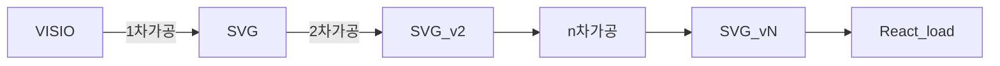

# SVG React 활용방안
목적 : React에서 SVG 를 Load 하여 특정 atrribute , value , Style을 제어


## React 에서 SVG를 Load 하는 방법

### 1. \ 내 src를 추가 ( 부적합 )
```Javascript

```   
### 2. svg 내 namespace 형식 치환 후 render ( 보 )
Visio에서 Export한 SVG 파일 그대로 사용 불가 아래와 같이 치환 필요
단, svg row file 이나 마찬가지므로 react에서 제어 불가 ( javascript로 가능 )
|AS-IS	|TO-BE|
|-------|-------
|xmlns:xlink|	xmlnsXlink	|
|xmlns:ev	|xmlnsEv	|
|xmlns:v	|xmlnsV	|
|xml:space|	xmlSpace	|
|v:helloWorld|	vHelloWorld|   

### 3. Component 로 변환 후 render ( 적합 )
React에서 제어가능   
Online converter : [svg2jsx](https://www.svgviewer.dev/svg-to-react-jsx)

## SVG Convert to React Component

